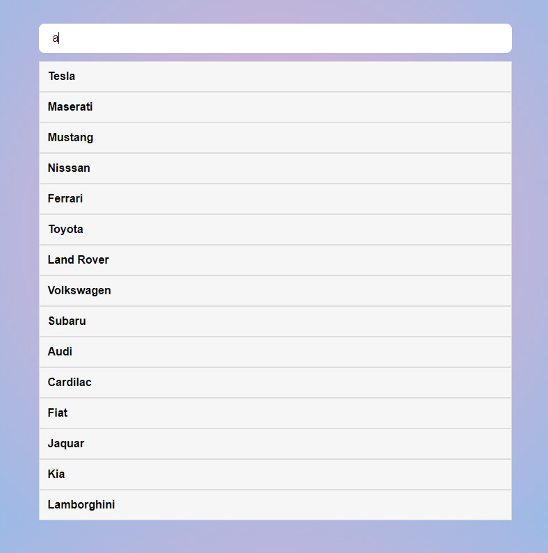

## JS LOOPS IN A PROJECT()

* Built this app from the knowledge covered from the topics covered i.e;
- Loops
- Functions
- Event Listeners
- Arrays

Join the platform on Discord -->>> [LearnWeb3 Dao](https://discord.com/invite/Mun67ckPUQ)